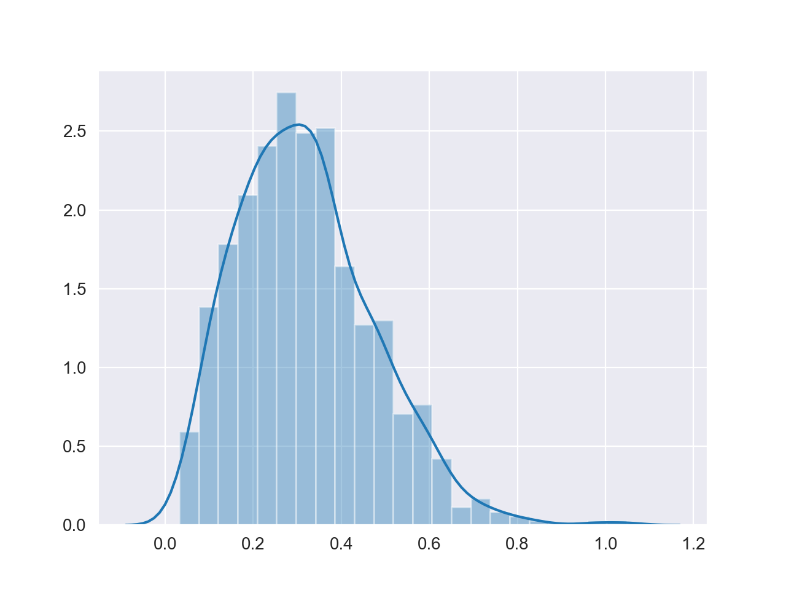

# gas_sim

## Important: This is a work-in-progress

This is a final project for my Statistical Mechanics class at Macalester. It is a simulation of an ideal gas using event-driven particle dynamics, which once complete I will use to verify some aspects of stat mech, such as the ideal gas law.

## Preliminary Result: Distribution of Particle Speeds approaches Maxwell-Boltzmann Distribution

The image below shows the velocity distribution after a simulation run with parameters: t = 10000, vol = 600, n_atoms = 800, particle_mass = 2, particle_radius = 0.5, total_energy = 100. As can be seen, the distribution has the characteristic right-tailed shape of a Maxwell Distribution.

